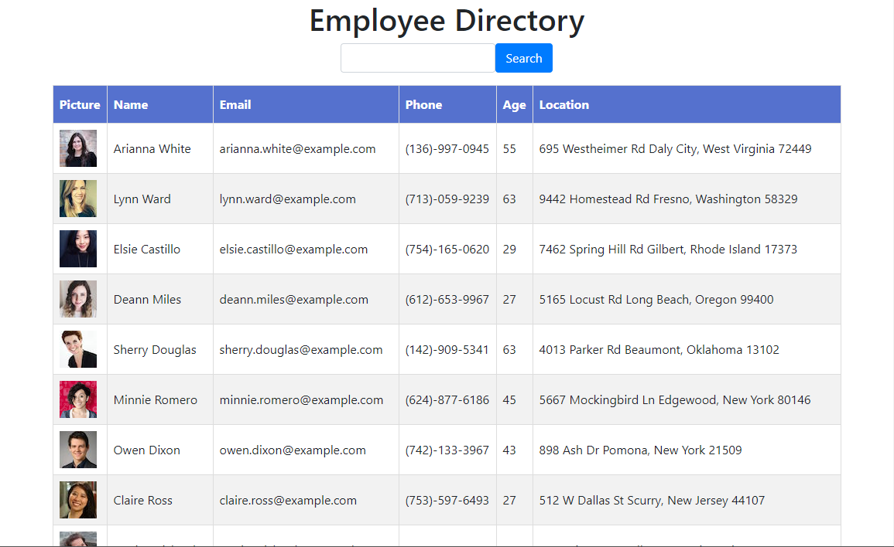

# Employee Directory
[](https://lbesson.mit-license.org/)



## Description
Employee directory is a simple app built with React that gives you a quick and easy way to view your employees. You can quickly search by name or sort by any field to find the employee you are looking for

## Table of Contents
* [Installation](#Installation)
* [Usage](#Usage)
* [License](#License)
* [Questions](#Questions)

## Installation
To install necessary dependencies, run the following command:
```
npm i
``` 

## Usage
This repo is deployed at https://eb-react-directory.herokuapp.com/. You may also download the code and run it locally. Just `npm i` then `npm start`.

## License
[](https://lbesson.mit-license.org/) 

This application is covered by the MIT license.

## Questions
Find all of my repos at /elijah415hz. 

Please email me at elijahblaisdell@gmail.com with any questions.
